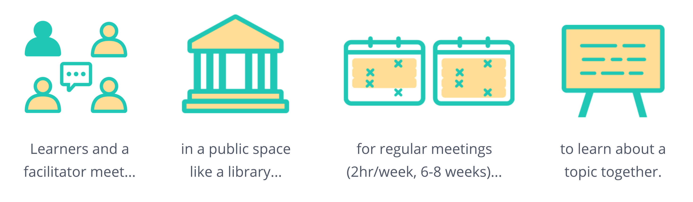

# Learning Circles Handbook

Learning circles are free facilitated study groups for those who want to learn new things together. This knowledge base is a comprehensive resource about learning circles: how they work, how to start one, and how to enjoy the process!

| Get started: | For Facilitators | For Organizations |
| :--- | :--- | :--- |
| 🟡 [What is a learning circle?](learning-circles/learning-circles-1.md) 🟡 [Intro to Learners]() | 📍 [Intro to Facilitation](facilitation/basic-facilitation-strategies/) 🟡 [How do I start a learning circle?](facilitation/basic-facilitation-strategies/) | 📍 [Organizers & Teams](facilitation/organizers/) 🟡 [Start a Team](facilitation/organizers/start-a-team.md) |

