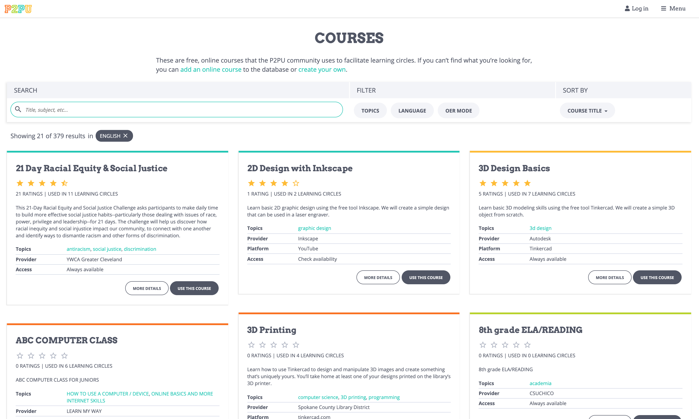

# Choosing a Course

Learning circles connect people around a topic of common interest, supported by freely accessible learning resources. While the group's facilitator is not expected to be an expert in the subject, it's the facilitator's job to identify these resources before the learning circle begins. 

Many facilitators use free online courses for subject material because they are designed in a linear format that is easily adaptable to group study. While these so-called MOOCs \("Massive open online courses"\) work quite well as the content basis for learning circles, there is a broad world of openly-available information that comes in all shapes and sizes. With some time and practice, nearly any learning resource can be adapted to the learning circle model, from YouTube playlists to software tutorials to the US Citizenship Exam website. \(See [**Adapting a Course**](adapting-courses.md)\)

P2PU has a firm stance on what attributes best embody the values of a learning circle while simultaneously easing the work for facilitators. Sometimes, this requires adapting the learning materials and creating a facilitator guide. Courses that meet these characteristics are featured on [P2PU's course library](https://www.p2pu.org/en/courses/).

A final note: Regardless of where the content comes from, there is no such thing as a perfect course! No matter how well content is arranged, a course will never know you as a person, help you make decisions, or tell you when you need to look for answers somewhere else. The learning circle format and the power of peer learning do a lot of work to create a great learning experience. At its best, a course is a starting point for a community of learners to reach common goal, wherever that path may lead. 

## P2PU's Course Library 


### Visit the course library: [p2pu.org/en/courses/](https://www.p2pu.org/en/courses/)


P2PU maintains a space where the learning circle community can collect and share open courses found from across the web. With a few exceptions, P2PU does not create or own this content—it is primarily a curated list. Materials added to this list are moderated and removed if they are duplicated, no longer available, or otherwise inappropriate for learning circles.

Anybody with a P2PU account can add a course to the P2PU course library by filling out the "[Add a Course](https://learningcircles.p2pu.org/en/course/create/)" form which asks for the following information:

* **Course title**
* **Course website link**
* **Course platform** \(e.g. Coursera, edX, FutureLearn, Udacity\)
* **Course creator** \(e.g. MIT, University of Michigan, Khan Academy\)
* **Short Course description** \(1-2 sentences that describe what people will accomplish if they take this course. This description is what learners will see when signing up for learning circles, and what facilitators will see when selecting a course.\)
* **Availability** \(indicates if the course is openly licensed or on-demand, meaning that there are no scheduled start and end dates for course availability\)
* **Topic tags** \(a few topics that will help learners and future facilitators find this course\)
* **Language of the course materials**
* **Course license** \(copyright status of the materials, often found on the course or provider's page\)

This information is shared on detail pages for each individual course. These pages are updated automatically to include details about how the materials have been used for learning circles, including:

* **1–5 star community ratings** \(from facilitator and participants\)
* **Links to a dedicated discussion about the course** in the P2PU forums

## Evaluating Courses

You do not need to be an expert in the course material in order to facilitate a learning circle. However, whether you are looking on P2PU’s course database or elsewhere on the web, you’ll want to review the course before you create a learning circle. A few key points to consider when evaluating courses:

* **Open Access:** Far more than being free to use, open access [allows for the 5 R's](https://courses.lumenlearning.com/pathways/chapter/reading-the-5rs-of-oer/): retaining, reusing, revising, remixing, and redistributing. Open access allows for knowledge sharing and adapting in ways that simply isn't possible with proprietary courses, even if they are freely available. A [Creative Commons license](https://creativecommons.org/licenses/) is a good sign!  Note: many free courses aren't always available: make sure it aligns with your schedule. \(OER = [Open Educational Resources](https://en.wikipedia.org/wiki/Open_educational_resources)\).
* **Clear Prerequisites:** Even the most basic course has pre-requisites \(time, literacy\). Ensuring alignment between the stated goals of the course and what is expected beforehand is important.
* **No Additional Materials Required:** There's nothing more discouraging than beginning a course only to learn that there is an expectation that you have access to software or a book that aren't freely available to everyone in the learning circle. 
* **High Quality of Instruction:** Are the course materials and the platform intuitive to use?
* **Adaptability to learning circles**: Do the activities make sense being done together as group work? Is information shared in a linear format that will be easily adaptable to group study? 
* Where does it come from? 
* **Acceptable Workload:** Does the weekly time commitment and duration of the course align with your expectations? It's totally fine to decide that you'll only work through part of a course; just make sure you set a reasonable goal for participants.

### Additional Considerations for Virtual Learning Circles

When public access to library equipment, internet connection, and in-person support are a limited or unavailable option, it's important to keep in mind the types of access barriers your learners may have. As you’re assessing courses, here are some extra considerations for choosing the right material:

* Support for low bandwidth: If your learners don’t have reliable internet connections at home, courses with fewer videos and interactive elements might be more accessible. 
* Mobile-friendly: Many learners may not have a computer but can still participate via a smartphone or tablet. Fortunately, some course providers \(including edX, FutureLearn, Coursera, and Udacity\) offer mobile apps.
* Digital literacy: Will learners need guidance or tech support to navigate a course website on their own? 
* Tool Requirements: Consider the things your learners will need to complete a learning circle. Are there tools or materials they need to anticipate having access to? 

