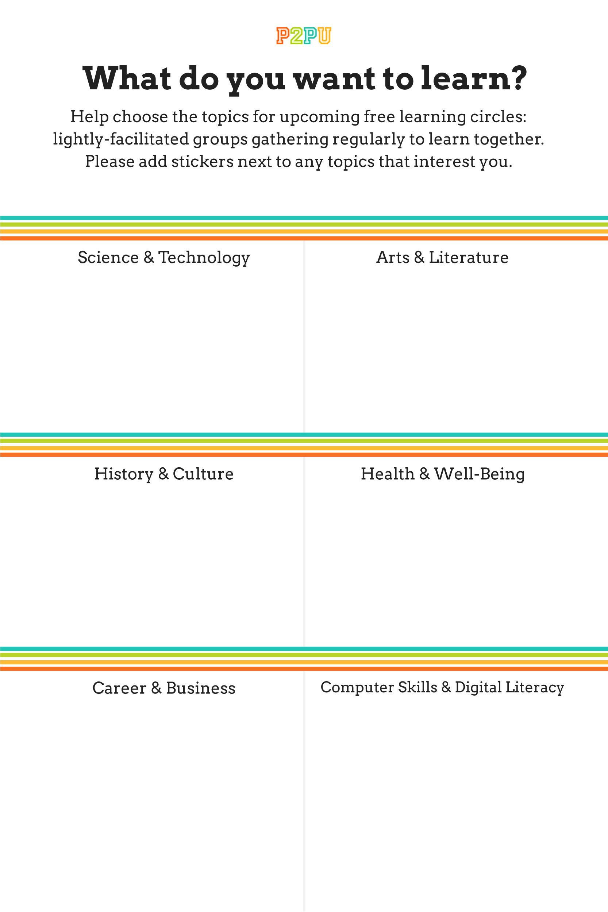
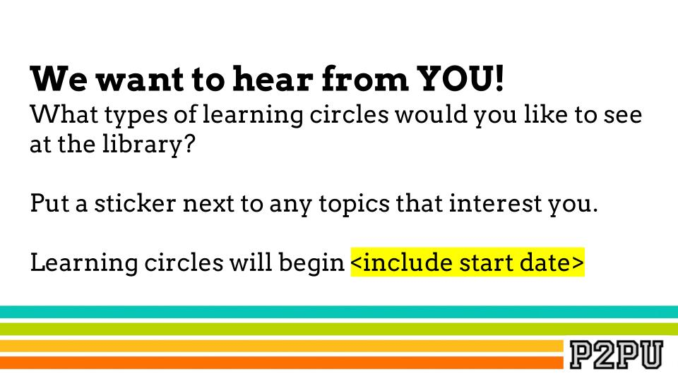

# Setting Intent

Learning circles work best when learners can identify what motivates their participation, and the same is true for the facilitator. As you begin thinking about the learning circles you want to run, here are some questions you can ask to set your intent:

* What are you personally hoping to achieve by facilitating a learning circle?
* What need are you trying to address in your community?
* Who do you expect to reach?
* How will you know if your experiment was a success?

Once you’ve established your personal goals for a learning circle, you’ll want to start sharing your ideas and gathering buy-in from people who will help you along the way. This may include reaching out to people who you think might want to participate, organizations that might help you promote your learning circle, or a group that you are part of that can give you feedback on your idea. You are also, of course, welcome to reach out to P2PU at any time if you want our input! 

## **Identifying Community Interests**



If your goal is to run programs that support the needs of your local community, you may want to gather insights and interests from prospective learners. By working with partner organizations and networks, building strong relationships between you and people around you, and outreaching to specific audiences, you’ll be much better suited to know what people in your local area want to learn and how to reach them.

Community outreach can be done successfully in a variety of ways, in-person and online, and will often depend on your unique resources and circumstances. Here are some popular tools and strategies:

* **Promotion:** Use organizational or local mailing lists, neighborhood apps \(like [Nextdoor](https://nextdoor.com/)\), local social media groups, or other local outreach lists to reach a number of people in your community with questions or surveys. We use Google Forms frequently at P2PU and have a [topic survey template](https://docs.google.com/forms/d/e/1FAIpQLSe5TByw6oXOFz3EluzEiZ_aA6BdWKQg0oBGSjWPW1XgkSMVbA/viewform?usp=sf_link)  that you can riff off of for your own uses. Collaborative polling tool like [Tricider](https://www.tricider.com/) are also great for starting conversations between respondents. 
* **Focus Groups:** In Kenya, libraries run [mini focus groups](https://community.p2pu.org/t/library-patron-focus-group/3129) as part of their learning circle training. They get a quick idea of what their local library patrons are interested in and their digital literacy skills which they can use for discussion as they continue their training workshop. Some libraries have offered a learning circle teaser or public orientation where they introduce the concept of learning circles through an informal meeting or large presentation and, through these meetings, they also receive feedback about what people are interested in learning
* **Assess interests of and gather data from current students or patrons:** Observation and insights gathered from each branch and location is key to understanding your unique community. If you're part of a library, you can use collections data or access stats from institutional memberships \(like Lynda.com\) to understand what your patrons are seeking out.
* **Ask local businesses:** Visiting a number of local businesses and simply asking what skills or community programs they feel are missing.
* **Community partnerships:** National or regional partners have a good understanding of the needs and interests of people who may not be connected to your community agency or library. They might also host local meeting or meetups which you can support, host or collaborate with. 

## The Q Method

P2PU's go-to strategy for soliciting interest in learning circle topics is The Q Method, an asynchronous dot-based voting methodology that can be used in-person or online. The Q Method is named after Qumisha \(a.k.a. Q\) Goss, a librarian from Detroit Public Library who came up with the idea as a way to promote learning circles at her library branch. \(She now works with P2PU full-time—hi Q!\)

The Q Method is a participatory public bulletin, traditionally created using paper, tape, and dot stickers. The board documents and displays community interests on specific topics, online courses, or ideas. 

The Q Method not only invites community contribution for deciding topics, it also helps promote upcoming programs to everyone who wanders by the poster.  This concept has been re-used by learning circle facilitators around the world, and can also have applications for other community feedback issues, such as strategic planning, programming decision-making, and understanding community satisfaction and engagement.

Dot voting is an established facilitation method used to describe voting with dot stickers or marks with a marker pen. For more information, check out [Dotmocrocy](https://dotmocracy.org/). 

### Q Method Templates & Examples

If you want to use the Q Method in person, we've created a few templates you can use, modify, or reimagine with your own designs or topics. They're all built in Google Slides so you won't need to download any programs to modify them, just a Google-compatible account. 

To edit your own copy, click "view template" underneath the previews below; once you've opened the file, navigate to **File &gt; Make Copy** to save a version in your own Google Drive.

<table>
  <thead>
    <tr>
      <th style="text-align:left">
        
      </th>
      <th style="text-align:left">
        

        

          
        

      </th>
    </tr>
  </thead>
  <tbody>
    <tr>
      <td style="text-align:left"><b>18x24&quot; Poster (</b><a href="https://docs.google.com/presentation/d/1cZGxxRuC83qkD95dt1-mZ1vALDUxgup4C-tp9W-D3yI/edit#slide=id.gd36be7eca8_0_0"><b>view template</b></a><b>)</b>
      </td>
      <td style="text-align:left"><b>8.5x11&quot; Poster Series (</b><a href="https://docs.google.com/presentation/d/1UgIZQa0LQxJihHXadUk-71pURHRe3WjBjXhLmD5iYG4/edit#slide=id.p"><b>view template</b></a><b>)</b> 
      </td>
    </tr>
  </tbody>
</table>

Facilitators around the world have adapted this strategy to collect ideas for their learning circle programs. Visit our forums to [see examples and share your own.](https://community.p2pu.org/t/q-method-for-documenting-community-interests/2699/3)

### Virtual Q Method

To try the Q Method online, you can use a standard survey tool \(such as [Google Forms](https://www.google.com/forms/about/), [Typeform](https://www.typeform.com/), or [SurveyMonkey](https://www.surveymonkey.com/)\) where responses are aggregated and shared with you privately, or you can use a collaborative polling tool \(such as [Tricider](https://www.tricider.com/), [Mentimeter](https://www.mentimeter.com/), or [AnswerGarden](https://answergarden.ch/)\) where responses are shared publicly.

P2PU has created two Google Forms templates with different sets of topics based on the P2PU Q Method poster template shared above. You van view and make copies of them below:

View live form: [What do you want to learn? \(2018 topics\)](https://docs.google.com/forms/d/e/1FAIpQLSfVuVIcZqo758boUO0Crvz3J_2rq7pNCKwExTVA4natdt9oAA/viewform)  
Make a copy: [What do you want to learn? \(2018 topics\)](https://docs.google.com/forms/u/2/d/1mUnjGmm3YE8q4xkE3RAFKAcMgBi8QNX3DCrxrt_UXQA/copy)

View live form: [What do you want to learn? \(2021 topics\)](https://docs.google.com/forms/d/e/1FAIpQLSc3zmA-BR0hzRFLTc5WgNaYQ-teekxkvbe588bthVKb6fGLig/viewform)  
Make a copy: [What do you want to learn? \(2021 topics\)](https://docs.google.com/forms/u/2/d/1GLt_Y-lPJ4bHVZ4RUFPZI7IaN0bkBe9w_Vo0JGoSPGs/copy)

You can submit test responses to these surveys if you’d like to try them out, but please make your own copies before distributing to your community to avoid any security issues with learner contact info. Feel free to make any and all changes that you need to!

