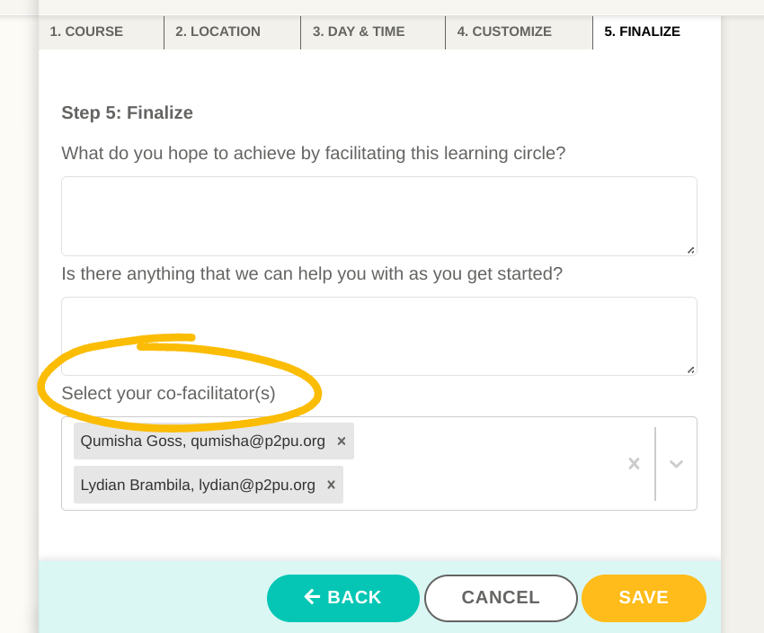

# Organizer Tools

### Facilitator Functionality

Adding or inviting a facilitator to your team will enable a variety functions:

* Their P2PU profile image will appear on your team page
* Any learning circle they create will show up on your team page
* Their learning circle signup pages will list an affiliation with your team and include a link back to your team page
* They will see details about all learning circles happening on the team on their dashboard, and they'll have the option to opt into weekly team summary emails
* They will be able to create learning circles using any proprietary courses that have been added to the P2PU courses page by their team members

### Adding Team Members

Once your P2PU account is set up as an organizer, you will see a new block on your learning circle dashboard called _Team Management_, where you can view and invite members to your team.&#x20;

.png>)

‌There are three ways to invite people to join your team:

1. **Automatically through email domain:** If your team is associated with an organization that has its own email domain, P2PU can save the email domain in your team settings so that any new facilitator with a validated matching email address will automatically receive an invitation to join your team. For example, if your team members all have staff emails such as _sharon@bigpubliclibrary.org_, you can set _bigpubliclibrary.org_ as your team domain so that when _nico@bigpubliclibrary.org_ registers on the P2PU platform, they’ll be automatically invited to join.
2. **Email invitation**: You can send invitations directly via email from your dashboard. If the recipient already has a P2PU account, they will be prompted to join your team. If they do not, they will be asked to create a P2PU account and then prompted to join your team.
3. **Invitation link:** You can also generate a unique link that allows anyone with the link to join your team. You can regenerate this link whenever you want, making all previous links inactive.

### **Pending Invitations**

Invitations that have been sent via Option 1 or Option 2 will be visible in the “pending invitations” tab until the user accepts or rejects the invitation.

### Removing Team Members

Organizers can remove team members through the same management table. When a team member is removed, learning circles that they facilitated as part of your team will continue to show up as past learning circles for your team. If you'd like to remove these reach out to us.

### Facilitator Profiles

All P2PU account holders can update their profiles through [account settings](https://learningcircles.p2pu.org/en/accounts/settings/\)). In addition to appearing on learning circle sign up pages, their avatar will also appear on the team page carousel. Team members who have uploaded a photo will appear first, followed by others with a placeholder image (example below). Organizers should encourage facilitators to add an image so that they can be fully featured on their team site!

### Adding a co-facilitator

[Co-facilitation](https://docs.p2pu.org/facilitation/facilitation-basics#working-with-a-co-facilitator) is a great way to share facilitation responsibilities with colleagues. Teams members have the added benefit of adding co-facilitators to their learning circles. This function allows all co-facilitators to edit the learning circle, view messages from learners, and submit feedback at the end of the learning circle.

Teams members can add a co-facilitator during the final step of the learning circle creation process. You can edit your learning circle to add or remove co-facilitators at any time.&#x20;

