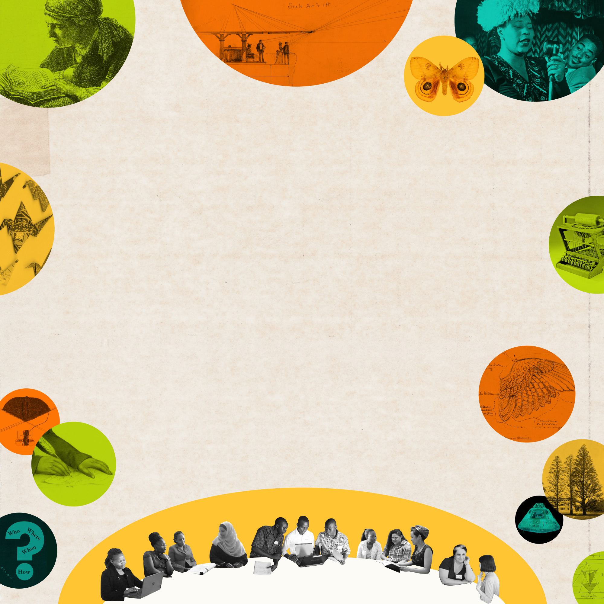
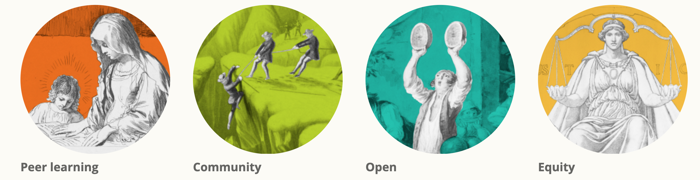
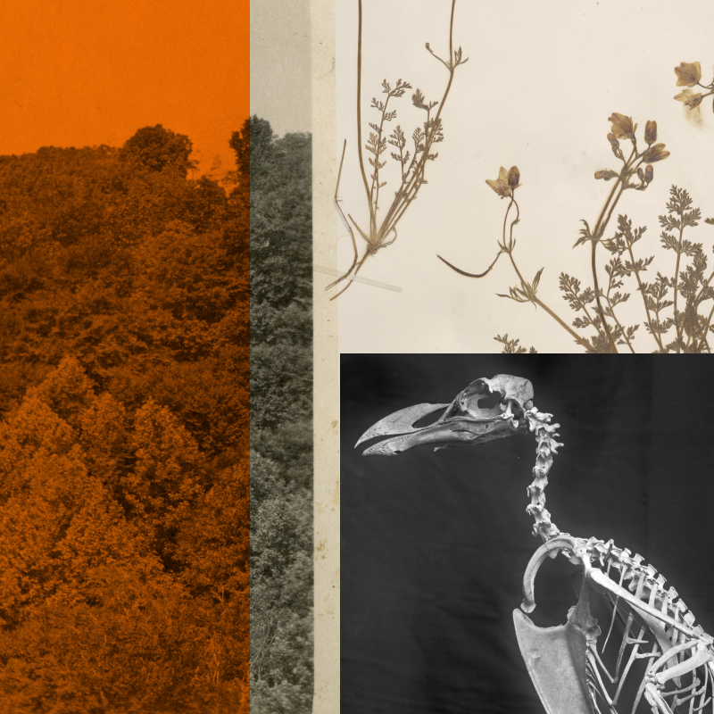
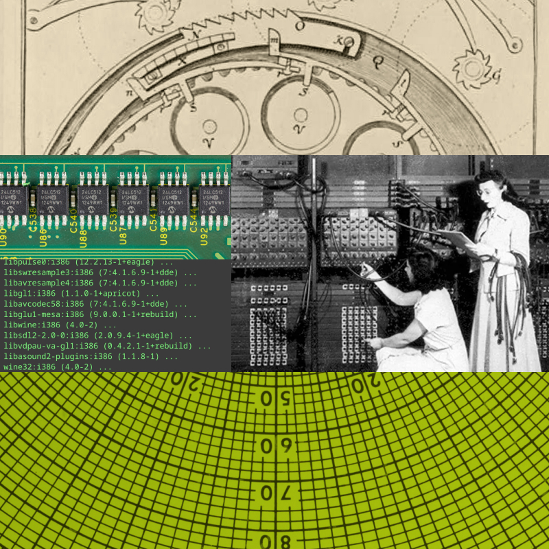
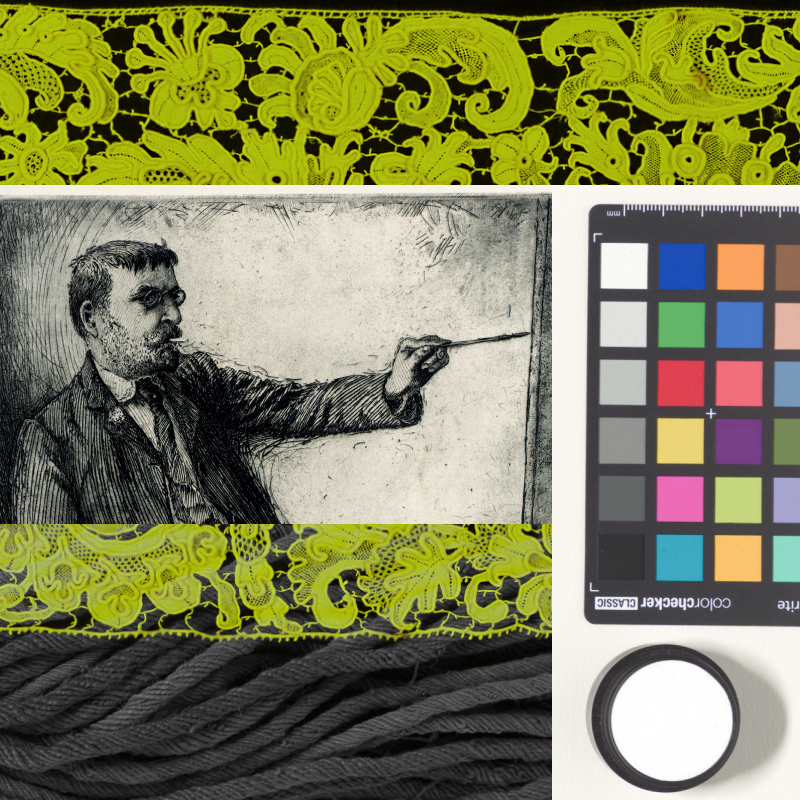
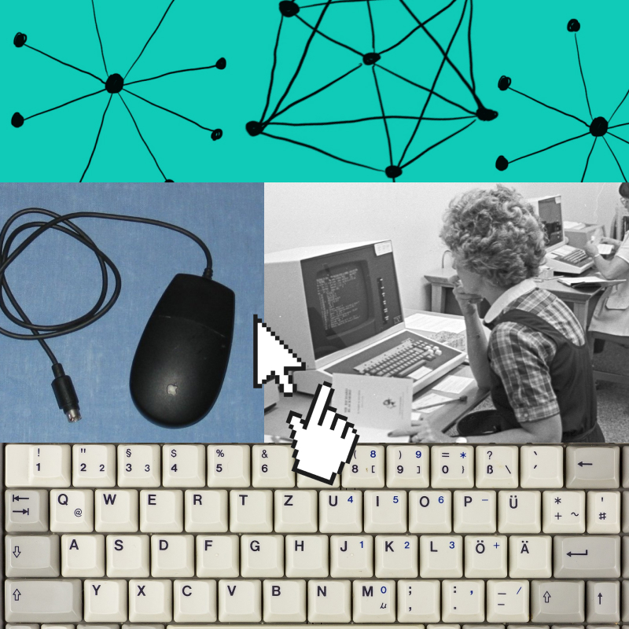
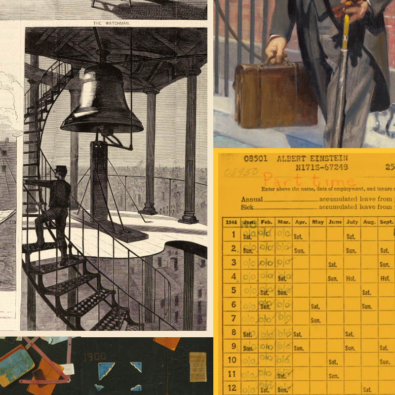

# Collage & Image Credits

One of P2PU’s 4 core values is _open_: the belief that we create value not by gatekeeping but instead by working together, sharing resources, and lowering barriers to entry. P2PU is built on open source technology and everything we create is free to share, remix, and redistribute.

In that spirit of open, we use collage in our visuals, often paired with [images from our community](https://www.flickr.com/groups/p2pu/pool/), to diversify the imagery and imagination of the look and feel of P2PU.

## Make Your Own P2PU Collage

We've designed free [DIY flyer templates](https://docs.p2pu.org/facilitation/finding-participants#diy-flyers) in Google Slides to help you create promotional materials with collages for your learning circles. Check out our [DIY Collage + Flyer Kit](https://docs.google.com/presentation/d/1\_-Xl0TcniaRjYuK7E8JFMekrMDM3\_TLfBHAj6x61AMY/edit?usp=sharing)!

Below we’ve shared a few of our favorite sources for open-access imagery to inspire your works\*.&#x20;

* [Smithsonian Open Access](https://www.si.edu/openaccess)
* [Wikimedia Commons](https://commons.wikimedia.org/wiki/Main\_Page)
* [Library of Congress Free to Use](https://www.loc.gov/free-to-use/)
* [National Gallery of Art ](https://www.nga.gov/open-access-images.html)
* [WorldImages](https://worldimages.sjsu.edu/)
* [Public Domain Review](https://publicdomainreview.org/)

\*Many media archives in the United States highlight the disproportionate representation of wealthy white people in historical narratives. To counter this, P2PU makes a dedicated effort to prioritize respectful depictions of people of color and women in our collages. We review the content of all materials we include in our collages (even when it’s obscured or illegible in the final piece) to avoid sources or materials that contain violent, harmful, or otherwise disrespectful representations of human beings.

## P2PU.org Image Credits

### [Homepage](https://www.p2pu.org/en/)****

**Header collage:**

* _Program from the NOMA Second Annual Conference_ by National Organization of Minority Architects via National Museum of African American History and Culture ([TA2017.53.5.1.12.2](https://www.si.edu/object/program-noma-second-annual-conference:nmaahc\_TA2017.53.5.1.12.2))
* _Unfinished bag_ via Cooper Hewitt, Smithsonian Design Museum ([1955-63-3](https://www.si.edu/object/unfinished-bag:chndm\_1955-63-3))
* _JOHN RIDGE, A CHEROKEE., from History of the Indian Tribes of North America_ via Smithsonian American Art Museum ([1985.66.153,299](https://www.si.edu/object/john-ridge-cherokee-history-indian-tribes-north-america:saam\_1985.66.153\_299))
* _Black Studies: Paradox with a Promise_ by National Council for Black Studies via National Museum of African American History and Culture ([2012.22.17](https://www.si.edu/object/black-studies-paradox-promise:nmaahc\_2012.22.17))
* _Study of a Wing_ by Francis Augustus Lathrop via Cooper Hewitt, Smithsonian Design Museum ([1914-38-213](https://www.si.edu/object/study-wing:chndm\_1914-38-213))
* _Trees in Washington, DC_ via Smithsonian Institution Archives, Record Unit 7355, Martin A. Gruber Photograph Collection ([SIA2010-2294](https://www.si.edu/object/trees-washington-dc:siris\_arc\_291967))
* _Command Module, Apollo 11_ via National Air and Space Museum ([A19700102000](https://www.si.edu/object/command-module-apollo-11:nasm\_A19700102000))
* _Perspectiva: Corporum Regularium_ by Wenzel Jamnitzer via Cooper Hewitt, Smithsonian Design Museum ([1957-192-3-2](https://www.si.edu/object/perspectiva-corporum-regularium:chndm\_1957-192-3-2))
* _Woman Reading_ by Rembrandt Harmensz van Rijn via Cooper Hewitt, Smithsonian Design Museum ([1949-100-5](https://www.si.edu/object/woman-reading:chndm\_1949-100-5))
* Eight Origami Cranes by Ira Blount via Anacostia Community Museum ([2011.0004.0092](https://www.si.edu/object/eight-origami-cranes:acm\_2011.0004.0092))
* _Untitled (Perspective Sketch)_ by Louis Schaettle via Smithsonian American Art Museum and its Renwick Gallery ([1966.32.16](https://www.si.edu/object/untitled-perspective-sketch:saam\_1966.32.16))
* _Io Moth_ via National Museum of Natural History ([EO21568](https://www.si.edu/object/io-moth:nmnheducation\_10002457))
* _Ella Fitzgerald (with Ray Brown, Dizzy Gillespie, and Milt Jackson)_ by William Paul Gottlieb via National Portrait Gallery (NPG.2016.60)
* _Sholes & Schwalbach Patent Model for Improvement in Type-Writing Machines_ via National Museum of American History ([1981.0359.02](https://www.si.edu/object/sholes-schwalbach-patent-model-improvement-type-writing-machines:nmah\_1383308))

**Learning circle icons:**

* **No expert required:** _Man Giving Speech_ by via Cooper Hewitt, Smithsonian Design Museum ([1901-39-1393](https://www.si.edu/object/man-giving-speech:chndm\_1901-39-1393))
* **Explore any topic:** _The Copper Plate Engraver_ via Cooper Hewitt, Smithsonian Design Museum ([1949-152-51](https://www.si.edu/object/copper-plate-engraver:chndm\_1949-152-51))
* **Learn better together:** _Lunch Hour_ via Smithsonian American Art Museum and its Renwick Gallery ([1971.214](https://www.si.edu/object/lunch-hour:saam\_1971.214))
* **Access for all:** _United States National Museum Library_ via Smithsonian Libraries and Archives ([MAH-3666](https://www.si.edu/object/united-states-national-museum-library:siris\_arc\_389215))

.png>)

#### **Join the Community:**

* _Commercial_ via Smithsonian Open Access ([2011.109.13.3](https://www.si.edu/object/commercial:nmaahc\_2011.109.13.3))
* _Handwritten Note, Manuscript Page of Knitting Instructions_ via Cooper Hewitt, Smithsonian Design Museum ([2000-69-1264](https://collection.cooperhewitt.org/objects/18683907/))
* _Library date due slip_ via Labratmatt, CC BY-SA 4.0, Wikimedia Commons ([source](https://commons.wikimedia.org/wiki/File:Library\_date\_due\_slip.jpg))

.png>)

#### **Start a Team:**

* _Study for "Mathematics," "The Sciences," Library of Congress, Washington D.C._ via Cooper Hewitt, Smithsonian Design Museum ([1923-6-23](https://www.si.edu/object/study-mathematics-sciences-library-congress-washington-dc:chndm\_1923-6-23))
* _Ceiling paper_ via Cooper Hewitt, Smithsonian Design Museum ([1974-5-1](https://www.si.edu/object/ceiling-paper:chndm\_1974-5-1))
* _Library_ via Cooper Hewitt, Smithsonian Design Museum ([2007-27-80](https://www.si.edu/object/library:chndm\_2007-27-80))

## [About](collage-and-image-credits.md#make-your-own-p2pu-collage)

* **Our Values, Peer Learning:** _The Virgin Teaching the Infant Jesus_ via Cooper Hewitt, Smithsonian Design Museum ([1896-3-274](https://www.si.edu/object/virgin-teaching-infant-jesus:chndm\_1896-3-274))
* **Our Values, Community:** _The ascent of Mont Blanc, no. 1 "The Glacier du Tacconay"_ via Harvard Library ([source](https://iiif.lib.harvard.edu/manifests/view/drs:44233389$7i))
* **Our Values, Open:** _Water color; A Neapolitan watermelon shop_ via Cooper Hewitt, Smithsonian Design Museum ([1931-73-1](https://www.si.edu/object/water-color-neapolitan-watermelon-shop:chndm\_1931-73-1))
* **Our Values, Equity:** _Justice, Cartoon for Mosaic in Wisconsin State Capitol Rotunda_ via Cooper Hewitt, Smithsonian Design Museum ([1959-69-9](https://www.si.edu/object/justice-cartoon-mosaic-wisconsin-state-capitol-rotunda:chndm\_1959-69-9))

## Learning Resources

#### 

#### Antiracism

* _Put People Before Profits_ via National Museum of African American History and Culture ([2010.55.103](collage-and-image-credits.md#make-your-own-p2pu-collage))
* _Placard from memorial march reading "HONOR KING: END RACISM!"_ via National Museum of African American History and Culture ([2011.57.6](https://www.si.edu/object/placard-memorial-march-reading-honor-king-end-racism:nmaahc\_2011.57.6))
* _Poster for presidential candidate Shirley Chisholm_ via National Museum of African American History and Culture ([2014.167.3](https://www.si.edu/object/poster-presidential-candidate-shirley-chisholm:nmaahc\_2014.167.3))
* _Evidence of Intimidation & Fascist Crimes by USA: The War on the Black Panther Party 1968 - 1969_ via National Museum of African American History and Culture ([2015.97.13](https://www.si.edu/object/evidence-intimidation-fascist-crimes-usa-war-black-panther-party-1968-1969:nmaahc\_2015.97.13))

#### 

#### Climate Change

* _Hypecoum grandiflorum Benth._ via National Museum of Natural History ([03579702](https://www.si.edu/object/hypecoum-grandiflorum-benth:nmnhbotany\_15175377))
* _Great Auk Skeleton Mounted for Exhibit_ via Smithsonian Libraries and Archives ([SIA Acc. 11-007](https://www.si.edu/object/great-auk-skeleton-mounted-exhibit:siris\_arc\_390394))
* _Trees in Washington, DC_ via Smithsonian Libraries and Archives ([SIA RU007355](https://www.si.edu/object/trees-washington-dc:siris\_arc\_291973))

#### 

#### Computer Programming

* _Details of the mechanisms of the Leibniz calculator, the most advanced of its time_ by Jacob Leupold via Library of Congress Rare Book and Special Collections Division ([2006690495](https://www.loc.gov/resource/cph.3c10471/))
* _DDR4 SDRAM bar from Samsung with 16 GiB of memory at 2666 MHz._ by PantheraLeo1359531 via Wikimedia Commons ([source](https://commons.wikimedia.org/wiki/File:16\_GiB-DDR4-RAM-Riegel\_RAM019FIX\_Small\_Crop\_90\_PCNT.png))
* _Installation of WINE under Linux Deepin 20.1. OS_ by Deepin-Gemeinde/Screenshot by PantheraLeo1359531 😺, GPL [http://www.gnu.org/licenses/gpl.html](http://www.gnu.org/licenses/gpl.html), via Wikimedia Commons ([source](https://commons.wikimedia.org/wiki/File:VirtualBox\_Linux\_Deepin\_20.1\_LARGE\_18\_03\_2021\_11\_00\_20.png))
* _Reprogramming ENIAC_ via ARL Technical Library, Wikimedia Commons ([source](https://commons.wikimedia.org/wiki/File:Reprogramming\_ENIAC.png))
* _Computer, Dead Reckoning, Sally Ride_ via National Air and Space Museum ([A20140274000](https://www.si.edu/object/computer-dead-reckoning-sally-ride:nasm\_A20140274000))

#### 

#### Creativity

* _Parrot Painted by M Street High School Student_ via Anacostia Community Museum ([2011.1008.0006](https://www.si.edu/object/parrot-painted-m-street-high-school-student:acm\_2011.1008.0006))
* _Border_ via Cooper Hewitt, Smithsonian Design Museum ([1950-121-10](https://www.si.edu/object/border:chndm\_1950-121-10))
* _Untitled (Artist Painting)_ via Smithsonian American Art Museum and its Renwick Gallery ([1979.136.153](https://www.si.edu/object/untitled-artist-painting:saam\_1979.136.153))
* _Tassel_ via Cooper Hewitt, Smithsonian Design Museum ([1951-132-5](https://www.si.edu/object/tassel:chndm\_1951-132-5))

#### 

#### Digital Literacy

* _Different shape networks_ by Melusine Boon Falleur via Wikimedia Commons ([source](https://commons.wikimedia.org/wiki/File:Different\_shape\_networks.png))
* _Photo of an Apple Desktop Bus Mouse II - the black version_ by StephenEdmonds for http://popcorn.cx/computers/, CC BY-SA 2.5 AU, via Wikimedia Commons ([source](https://commons.wikimedia.org/wiki/File:Apple\_mouse\_desktop\_bus\_ii\_black.jpg))
* _A vector hand cursor and cursor._ by Lordalpha1 via Wikimedia Commons ([source](https://commons.wikimedia.org/wiki/File:Mouse-cursor-hand-pointer.svg))
* University of Texas at Arlington (U. T. A.) Library via University of Texas at Arlington Libraries, Special Collections ([AR324-6-22](https://library.uta.edu/digitalgallery/img/10003731))
* _Laptop Acrobat Model NBD 486C, Type DXh2 - German keyboard layout, compact form_ by Raimond Spekking via Wikimedia Commons ([source](https://commons.wikimedia.org/wiki/File:Laptop\_Acrobat\_Model\_NBD\_486C,\_Type\_DXh2\_-\_keyboard-8631.jpg))

#### 

#### Job Readiness

* _Watch-Tower, Corner of Spring and Varick Streets, New York, from Harper's Weekly, February 28, 1874_ by Winslow Homer via Smithsonian American Art Museum and its Renwick Gallery ([1996.63.93](https://www.si.edu/object/watch-tower-corner-spring-and-varick-streets-new-york-harpers-weekly-february-28-1874:saam\_1996.63.93))
* _Neville Chamberlain_ by Samuel Johnson Woolf via National Portrait Gallery ([NPG.86.TC81](https://www.si.edu/object/neville-chamberlain:npg\_NPG.86.TC81))
* _Old Time Card Rack_ by John F. Peto via The Phillips Collection ([source](https://commons.wikimedia.org/wiki/File:John\_Frederick\_Peto\_-\_Old\_Time\_Card\_Rack\_-\_Google\_Art\_Project.jpg))
* _Time Card for Albert Einstein_ via U.S. Civil Service Commission. 1883-1/1/1979, National Archives and Records Administration ([source](https://commons.wikimedia.org/wiki/File:Time\_Card\_for\_Albert\_Einstein\_-\_NARA\_-\_597840\_\(page\_3\).jpg))

****

**Language Learning**

* _Colophon in running script_ via Smithsonian National Museum of Asian Art ([source](http://n2t.net/ark:/65665/ye31ecd3c05-045a-4639-969e-59c8dd42f7a9))
* _Alphabet,_ c. 1525/1555 by Heinrich Aldegrever via Smithsonian National Gallery of Art ([source](https://www.nga.gov/collection/art-object-page.3503.html))
* _Sequoyah_, c. 1830 by Henry Inman via Smithsonian National Portrait Gallery ([NPG.79.174](https://npg.si.edu/object/npg\_NPG.79.174))
* _Annual report of the Bureau of Ethnology to the Secretary of the Smithsonian Institution_ (p. 548) by Col. Garrick Mallery, 1 July 1880 via Wikimedia Commons ([source](https://commons.wikimedia.org/wiki/File:Mallery\_PISL\_handshapes\_m-y.png))

**Communication**

* _Courtesan Kasugano Writing a Letter_ by Suzuki Harunobu, c. 1765 via Wikimedia Commons ([source](https://commons.wikimedia.org/wiki/File:%E9%9D%92%E6%A5%BC%E7%BE%8E%E4%BA%BA%E5%90%88-The\_Courtesan\_Kasugano\_Writing\_a\_Letter\_MET\_DP119531.jpg))
* Diagrams from _A System of Elocution, with Special Reference to Gesture, to the Treatment of Stammering, and Defective Articulation_ (1846) by Andrew Comstock, via Public Domain Review ([source](https://publicdomainreview.org/collection/the-postures-of-the-mouth-1846))
* _Advertising illustration of a hand writing with a fountain pen_ (1919) via Wikimedia Commons ([source](https://commons.wikimedia.org/wiki/File:The\_Swan\_Pen.png))

## Create an Account

#### Icons:

* **Tools:** Created by John Caserta from the Noun Project
* **Community:** Created by P2PU
* **Course Library:** Created by DvM Design from the Noun Project

## Explore Learning Circles

#### Icons:

* **Hosted by a Facilitator:** Created by P2PU
* **Peer Learning:** Created by P2PU
* **Meet Regularly**: **** Created by WEBTECHOPS LLP from the Noun Project
* **Dedicated Materials:** Created by Adrien Coquet from the Noun Project

## Help

#### Icons:

* **Forum:** Created by Vectors Point from the Noun Project
* **Knowledge Base:** Created by Abdellah El Falah El Quadmiry from the Noun Project
* **Community Calls:** Created by Danil Polshin from the Noun Project
* **Hire Us:** Created by The Icon Z from the Noun Project

## Dashboard

**Icons:**

* **Getting Started:** Created by David Khai from the Noun Project
* **Using the Tools:** Folder by WARPAINT Media Inc. from NounProject.com; Settings by Three Six Five from NounProject.com
* **Help:** Created by Adrien Coquet from the Noun Project
* **Meet with Q:** Created by Becky Margraf
* **Teams Documentation:** Documentation by shashank singh from NounProject.com
