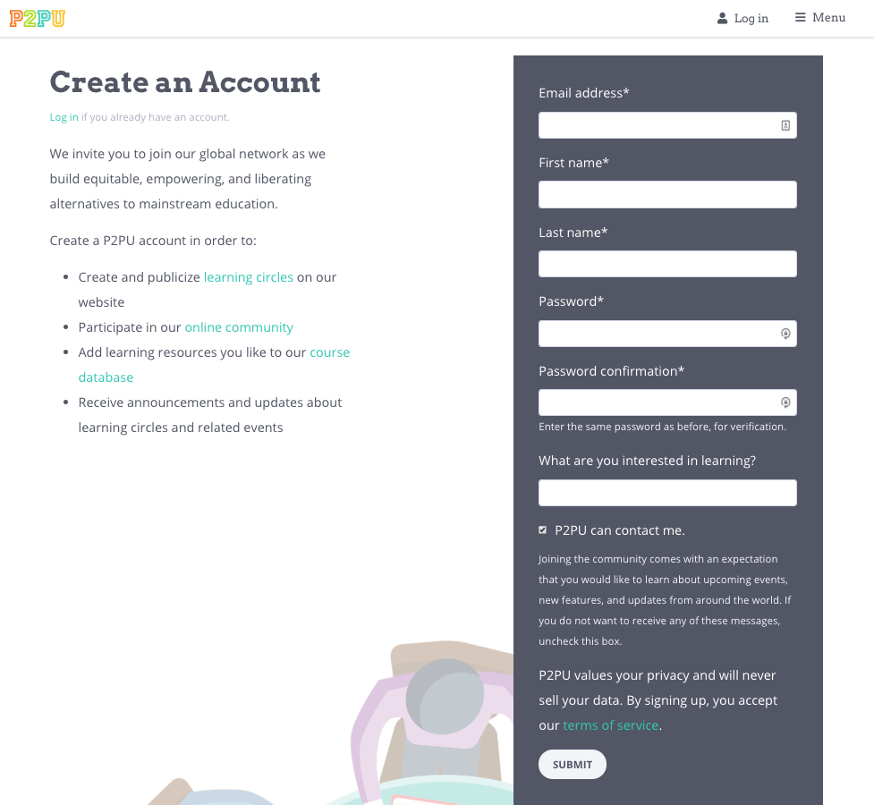

# Tools for Learning Circles

When learning circles first began in Chicago in 2015, we didn’t have any tools and software. We just worked with librarians to find online courses and helped them become better facilitators. Over time, as the project has grown, we have iteratively developed a number of tools and resources to create an online ecosystem for learning circle facilitators. These tools are designed to improve the experience for facilitators and learners alike. On the one hand, we aim to make organizing face-to-face meetings easier by simplifying promotion, sending reminders, aggregating data, etc. On the other hand, we seek to create a strong, networked, community where a learning circle in one city can benefit, in a small way, from the fact that learning circles are also happening elsewhere. Learning circles have been successful so far not just because we have developed a single resource, but because there is a vibrant community of practice that has formed around a series of tools and resources.

Our tools address the needs of three different groups:

1. Learners. People participating in learning circles.
2. Facilitators. People facilitating learnig circles.
3. Organizers. People organizing several learning circles across a town, city, or country. \(Often the organizer is also a facilitator\).

#### Learners can:

* Browse learning circles available in their area.
* Sign up for a learning circle.
* RSVP for weekly learning circle meetings.
* Complete a survey on their experience taking the learning circle.
* Receive an end-of-learning circle report from their facilitator.

#### Facilitators can:

* Use a step by step dialog to guide them through creating a learning circle.
* See who signed up, when meetings are scheduled, who can come, etc.
* Send messages to learners.
* Customize weekly reminders.
* Capture feedback after a meeting to gather and share reflections.
* Complete a survey on their experience facilitating a learning circle.
* Generate a report at the end of the learning circle.

#### Organizers can:

* See feedback from facilitators on weekly meetings.
* See what meetings are happening each week.
* Receive weekly updates on what happened in learning circles the previous week.
* Manage learning circles and facilitators.

## Using the tools

Learners do not need a P2PU account in order to join a learning circle.

To facilitate or organize learning circles, you’ll first need to create a P2PU account, which you can do from the P2PU homepage or [this link](https://learningcircles.p2pu.org/en/accounts/register/?next=/en/login_redirect/).

After setting your password you will be logged in and redirected to your learning circle dashboard.

The tools are hosted online and can be accessed from [www.p2pu.org](https://www.p2pu.org/)

All the source code is release under the MIT license and can be found on [GitHub](https://github.com/p2pu/learning-circles/).

