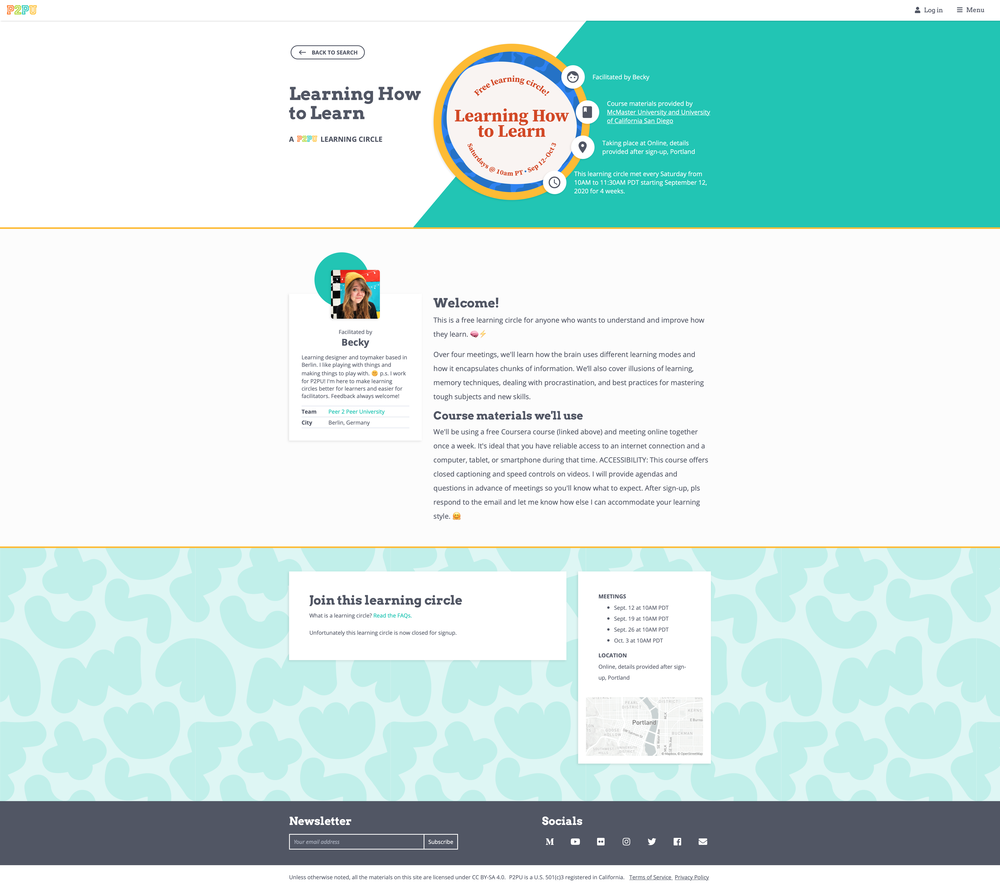

# Creating Learning Circles

P2PU offers a free system for creating and managing learning circle meetings. Once you've created a P2PU account and decided what learning circle you want to run, you can create your learning circle and publish it to the world.

#### **Create a learning circle:** [**https://learningcircles.p2pu.org/en/studygroup/create/**](https://learningcircles.p2pu.org/en/studygroup/create/)&#x20;

## Video: How to Create a Learning Circle (18m)



Or [view on YouTube](https://youtu.be/860ITkW8WmU) for more viewing controls and to enable closed captions.

## Walkthrough: How to Create a Learning Circle

Creating a learning circle is a 5-step process:

1. **Select a Course:** Identify the learning materials you'll be using
2. **Find a Location:** Share the details of where you'll be meeting (in person or online)
3. **Select Meeting Dates:** Choose the dates and times of your meetings (flexibly; you can update these later)
4. **Customize the Sign-Up Page:** Write any details about your learning circle (welcome message, materials needed, etc) to customize the public sign-up page
5. **Finalize:** Privately reflect on your goals for the learning circle and optionally ask for help if you need it.

### Publishing Your Learning Circle

Once you complete the creation process and publish your learning circle (either as a draft or a public circle), your sign-up page will automatically generated and look something like this:

You’ll receive a confirmation email which includes the link to your sign up page and a number of other resources. The P2PU Welcome Committee (a mix of P2PU staff and community members) will be copied on the email; if you asked for any help on Step 5, someone will reach out to ensure that your concerns are addressed before the learning circle begins.&#x20;

You can manage your learning circle at any time through your [Facilitator Dashboard](untitled.md).&#x20;
