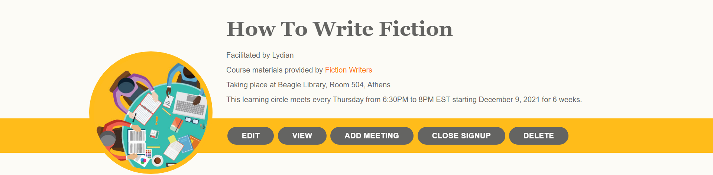

# Managing Learning Circles

Once a [new learning circle has been created](https://docs.p2pu.org/tools-and-resources/tools-for-learning-circles/creating-learning-circles) (either as a draft or after being published), P2PU will automatically generate a sign-up page and a private management page associated with that learning circle.&#x20;

The facilitator will receive a confirmation email with links to both the sign-up page and the private management page, which can also be accessed through their dashboard in the **My Learning Circles** section.

## Sections of the Management Page

.png>)

### Menu Tools&#x20;

The top section of the page shows a preview of the learning circle's information: title, image, facilitator info, link to the course materials, and meeting details.&#x20;

Below that is a yellow bar containing the following tools:

* **Edit:** Return to the [5-step learning circle creation form](creating-learning-circles.md) to update any information previously entered.
* **View:** See the live learning circle sign-up page.
* **Add Meeting:** Quickly add a new meeting to the learning circle. This will add a section for that meeting on the management page and automatically generate an editable reminder message for that meeting.
* **Close Signup:** Turn off the registration form on the sign-up page. (If signup is closed, the button will change to **Open Signup** and can be used to activate registration again anytime.)
* **Delete:** Delete the learning circle from public view and remove the records of the learning circle and registered learners from the P2PU database.

### Learners

  

All registered learners will appear in the Learners section of your dashboard. This will display the learner's full name and any contact information—email and/or phone—they've shared during sign-up. There are three buttons linked to each learner:

|  |  |  |
| :-------------------------------------------------------------------: | :-------------------------------------------------------------------: | :-----------------------------------------------------------------: |
|              **Edit** the learner's contact information               |  **Delete** the learner from the learning circle and P2PU's database  |       **See** the learner's response to the sign-up questions       |

The **Add Learner** button can be used to manually add participants to a learning circle. This only allows for adding a participant's name and contact information, not their answers to the sign-up questions. Note that this will automatically send a welcome message to the participant to let them know they've joined a learning circle.

If you would like to add multiple learners to your learning circle at the same time, click the **Add Learner** button, then choose **Click here to add multiple learners at once.** This feature is particularly useful for learning circles that use physical signup sheets for learners.

### **Messages**

The Messages section of your Learning Circle management page allows you to view, edit, and create reminders for your participants.  This section displays the reminder messages that will be automatically generated for each meeting as well as any messages the facilitator sends to their learners manually.&#x20;

**Meeting reminders** are automatically generated when a meeting is created, either during the learning circle's initial creation or when added afterwards. These messages can be edited from the Messages table or in the individual meeting's section of the meeting manager.&#x20;

.png>)

**Manual messages** allow the facilitator to send out information to all registered learners at any time via email or SMS. These messages will be sent immediately and cannot be scheduled to go out in the future. Manual messages have P2PU branding on them, and they will CC the facilitator and BCC all other recipients.

Facilitators can choose to manually send **meeting recap messages** to send out information to all registered learners after a meeting. These messages can be used to review what happened, share resources, and prepare for upcoming meetings.

### Meeting Manager

The meeting manager offers another way to manage automated and manual email reminders.

.png>)

The expanded Wrap Up section displays whether participants have taken the learner survey and provides a link to Learning Circle insights ([example](https://learningcircles.p2pu.org/en/studygroup/923/report/)).

### Communication and Feedback

Feedback is an important part of peer learning, and P2PU’s tools help gather and share information between learners, facilitators, and the P2PU team across the learning circle. P2PU holds user privacy to the utmost importance and we are compliant with the European Union General Data Protection Regulation (GDPR). Here is the type of communication that you can expect during a learning circle:

#### At sign up 

When creating a learning circle, facilitators are prompted to state their goals for leading a learning circle and ask any questions or concerns they might have. Their responses are shared with a group of people that can assist a facilitator. Similarly, when learners sign up, they are asked what their goals are for joining a learning circle. They are then introduced to their facilitator in an email containing their answers to the signup questions.

#### During the learning circle 

Each week, a reminder message is automatically sent to learners two days beforehand via email or SMS. Before the reminder is sent, you have the opportunity to log into their dashboard and customize the message. After each weekly meeting, you can record a weekly reflection on their dashboard and send it to your learners and/or P2PU.

#### Upon completion 

At the end of a learning circle, learners and facilitators receive an email with a link to a survey that asks everyone to reflect upon the goal they first set, what worked well, what could be improved, and what their next steps will be.

The responses to the surveys are used to generate a summary of the learning circle, we call this the “learning circle insights” ([here is an example](https://learningcircles.p2pu.org/en/studygroup/923/report/)). The learning circle insights are shared with the facilitator, any team organizers, and all the registered learners by email and is made public for other facilitators and learners to see.
