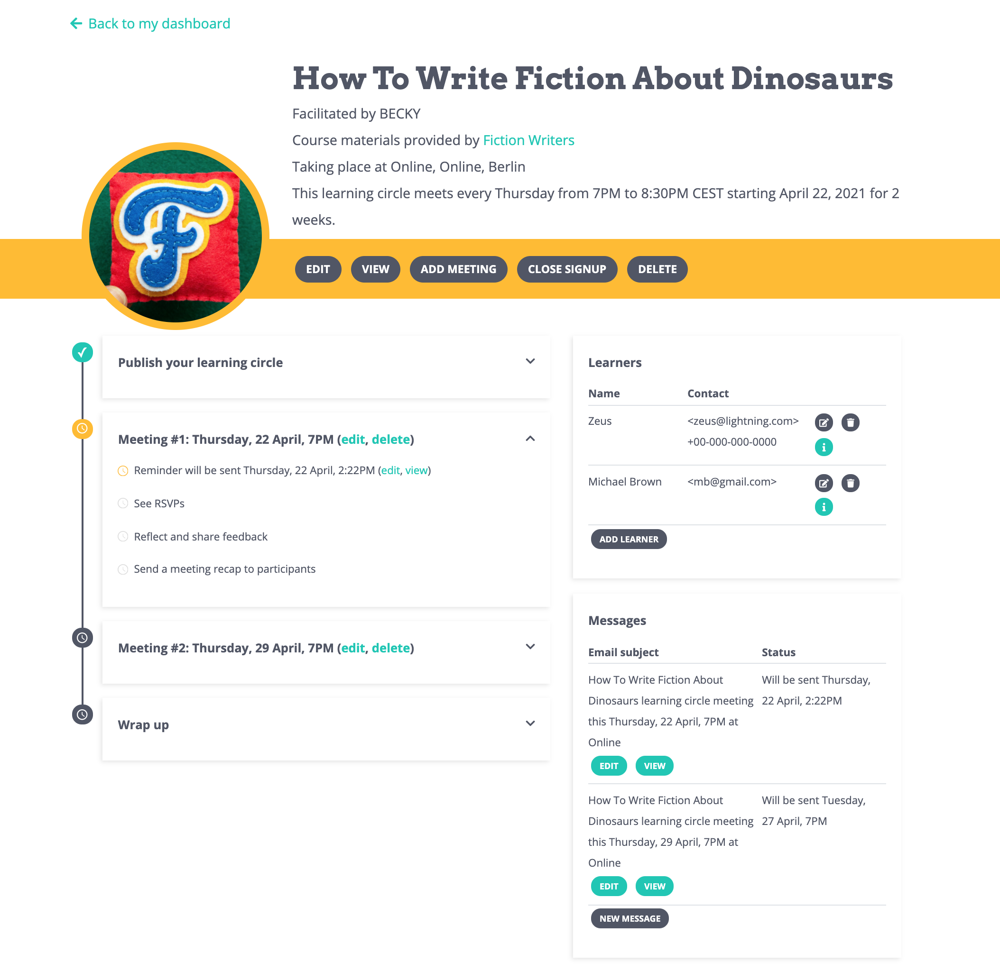

# Managing Learning Circles

Once you've [created a new learning circle](creating-learning-circles.md) \(either as a draft or live\), P2PU will automatically generate a sign-up page and a private management page associated with that learning circle. 

You will receive a confirmation email that contains links to both pages, and you can navigate to them manually on your Facilitator Dashboard. You'll find links to manage all of your own learning circles, current and past, in the **My Learning Circles** section.

## Sections of the Management Page

 Every learning circle's management page looks similar—the most visible difference you'll see is the title and image you've selected for your learning circle. This page is set up to follow a linear path through your learning circle with sections showing the actions you can take for each meeting.

### Menu Tools 

The top section of the page shows a preview of your learning circle information: title, image, facilitator info, link to the course materials, and meeting details. Below that is a yellow bar containing the following tools:

* **Edit:** Return to the [5-step learning circle creation form](creating-learning-circles.md) to update any information you've previously entered.
* **View:** See your live learning circle sign-up page.
* **Add Meeting:** Quickly add a new meeting date of your choice to your learning circle. This will add a section for that meeting on the management page and automatically generate an editable reminder message for that meeting.
* **Close Signup:** Turn off the registration form on your sign-up page. \(If you close signup, the button will change to **Open Signup** and you can activate registration again anytime.\)
* **Delete:** This will delete your learning circle from public view and remove the records of the learning circle and registered learners from the P2PU database.

