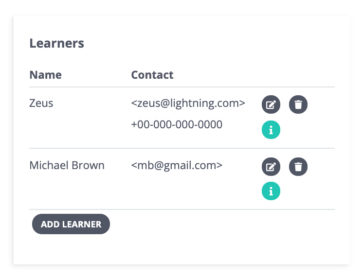

# Managing Learning Circles

Once a [new learning circle has been created](creating-learning-circles.md) \(either as a draft or live\), P2PU will automatically generate a sign-up page and a private management page associated with that learning circle. The facilitator will receive a confirmation email with links to both pages which can also be found on their dashboard in the **My Learning Circles** section.

## Sections of the Management Page

### Menu Tools 

The top section of the page shows a preview of the learning circle's information: title, image, facilitator info, link to the course materials, and meeting details. Below that is a yellow bar containing the following tools:

* **Edit:** Return to the [5-step learning circle creation form](creating-learning-circles.md) to update any information previously entered.
* **View:** See the live learning circle sign-up page.
* **Add Meeting:** Quickly add a new meeting to the learning circle. This will add a section for that meeting on the management page and automatically generate an editable reminder message for that meeting.
* **Close Signup:** Turn off the registration form on the sign-up page. \(If signup is closed, the button will change to **Open Signup** and can be used to activate registration again anytime.\)
* **Delete:** Delete the learning circle from public view and remove the records of the learning circle and registered learners from the P2PU database.

### Learners

All registered learners will appear in the Learners section of the page. This will display their full name and any contact information—email and/or phone—they've shared during sign-up. There are three buttons linked to each learner:

|  |  |  |
| :---: | :---: | :---: |
| **Edit** the learner's contact information  | **Delete** the learner from the learning circle and P2PU's database | **See** the learner's response to the sign-up questions |

The **Add Learner** button can be used to manually add participants to a learning circle. This only allows for adding a participant's name and contact information, not their answers to the sign-up questions. Note that this will automatically send a welcome message to the participant to let them know they've joined a learning circle.

### **Messages**

The Messages section shows the reminder messages that are automatically generated for each meeting as well as any messages the facilitator sends to their learners manually. \(Note that this table doesn't include every automated message sent to a learner—see [**Automated Messages & Surveys**](automated-messaging.md)\)

**Meeting reminders** are automatically generated when a meeting is created, either during the learning circle's initial creation or when added afterwards. These messages can be edited from this table or in an individual meeting's section of the meeting manager. \(See [**Automated Messages & Surveys**](automated-messaging.md)\)

**Manual messages** allow the facilitator to send out information to all registered learners at any time via email or SMS. These messages will be sent immediately and cannot be scheduled to go out in the future. Manual messages have P2PU branding on them, will CC the facilitator, and BCC all other recipients. \(See [**Automated Messages & Surveys**](automated-messaging.md)\)

### Meeting Manager

